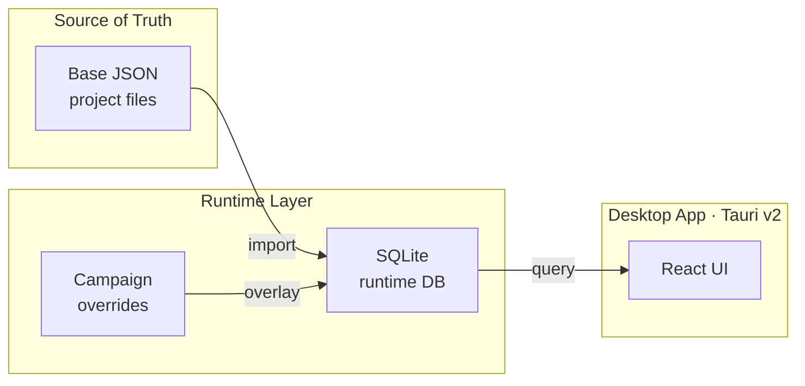

# WorldBuilderX

   

> Local-first desktop workspace for building, organizing, and running fictional worlds.

WorldBuilderX is a structured worldbuilding tool for game masters and writers. World data lives as JSON on disk — readable, portable, and git-friendly. A SQLite runtime layer enables fast search, session views, and campaign overlays without touching the source files.

## Core Features

- **Entity model** — Characters, Locations, Factions, Items, Events, and more with a rich block-based editor
- **Knowledge views** — Full-text search, table view, wiki reading view, and filtered graph
- **Session mode** — Visibility conditions, variable system, capture inbox, and player view
- **Maps** — Image import, marker system, grid overlay, and session tracking
- **Export** — Cards, handouts, PDF/PNG export
- **Extensible** — Plugin system for custom entity types, renderers, and rulesets

## Architecture

## Milestones

| Milestone | Scope | Status |
|---|---|---|
| M0 | Project foundation & app shell | ✅ Done |
| M1 | JSON ground truth & runtime database | ✅ Done |
| M2 | Entity editing MVP + Relations | ✅ Done |
| M3 | Search & knowledge views | ✅ Done |
| M4 | Session mode | ✅ Done |
| M5 | Maps & export | ✅ Done |
| M6 | Plugins & rulesets | ✅ Done |
| M7 | Packaging & operations | ✅ Done |
| MI | UI Integration Sprint | ✅ Done |
| M8 | Session play mode | 🔄 In progress |
| M9 | System plugin & character sheet | 🔄 In progress |
| M10 | Multiplayer & player identity | ⏳ Planned |
| M11 | Localization / i18n | ⏳ Planned |

## Development

See [DEVELOPMENT.md](DEVELOPMENT.md) for setup, prerequisites, and verification workflow.

## License

Proprietary. All rights reserved.
