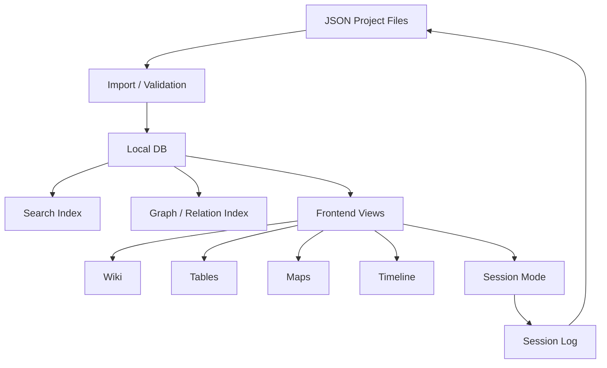

# Worldbuilding Tool Architecture Study

## Zielbild

Diese Studie beschreibt kein fertiges MVP und keine finale Tech-Entscheidung. Sie sammelt Architekturideen, technische Best Practices und Entscheidungsfragen für ein offlinefähiges, lokal betreibbares Worldbuilding-Tool mit Schwerpunkt auf PnP-GMs und sekundärem Anschluss an Game-Design-Workflows.

Der Kernanspruch ist:

> Lore wird nicht nur gespeichert. Lore wird spielbar, referenzierbar, filterbar, sichtbar/verdeckbar, auf Karten verortbar, in Zeit gesetzt und in Sessions zurückgeführt.

## Leitprinzipien

1. JSON bleibt die portable Ground Truth.
2. Eine lokale Datenbank ist trotzdem sinnvoll: für Suche, Indizes, Relations, Querying, Views und Session-State.
3. Entitäten sind wichtiger als Seiten.
4. Beziehungen sind Daten, nicht nur Textlinks.
5. Karten, Timelines, Tabellen, Boards und Texte sind nur verschiedene Projektionen auf dieselben Daten.
6. PnP braucht einen Live-Modus. Eine reine World-Bible reicht nicht.
7. Geheimnisse und Sichtbarkeit sind kein Add-on, sondern Kernmodell.
8. Plugins sollen zuerst Datenstrukturen erweitern; Spezial-UI darf optional dazukommen.
9. Suche muss Volltext, Aliase, Tags, Kategorien, Relations und unsaubere Benennung aushalten.
10. AI ist fuer V1 optional und sollte nicht Teil der Ground Truth sein.

## Empfohlene Grobarchitektur



## Recommended Baseline

| Layer | Empfehlung fuer V1 | Warum |
|---|---|---|
| Portable storage | JSON project files | Einfach, gitbar, exportierbar, KI-generierbar |
| Runtime DB | SQLite | lokal, leicht, FTS5, keine Serverinstallation |
| Advanced DB option | PostgreSQL | spaeter fuer Teams, starke FTS, JSONB, GIN |
| Search | SQLite FTS5 fuer V1, spaeter optional Meilisearch/Typesense | Offline und solide genug fuer lokale Projekte |
| Schema | JSON Schema + App-spezifische Plugin-Manifeste | Validierung, Dokumentation, Default-UI |
| UI generation | Hybrid: Schema erzeugt Default, UI-JSON ueberschreibt Spezialfaelle | klaut Notion-Feeling ohne UI-Chaos |
| Relations | Edge table mit relation_type und inverse_type | Bidirectional ohne doppelten Pflegeaufwand |
| Conditions | JsonLogic oder CEL | sichere, speicherbare Mini-Formeln |
| Frontend | Web-App, lokal gehostet | spaeter pywebview/Tauri/Electron moeglich |

## Why Notion Feels Good

Notion-Datenbanken fuehlen sich stark an, weil sie drei Dinge kombinieren:

1. Jede Tabellenzeile ist gleichzeitig eine Seite.
2. Jede Tabelle hat frei definierbare Properties.
3. Views sind Projektionen, nicht neue Datenkopien.

Technisch laesst sich das nachbauen mit:

```text
Entity
  id
  type
  title
  body_blocks
  properties_json

EntityType
  id
  schema_json
  default_view_config

View
  id
  source_type_or_query
  columns
  filters
  sorts
  grouping
  layout
```

Wichtig: Das Tool sollte nicht versuchen, Notion komplett zu kopieren. Notion ist generisch. Ein Worldbuilding-Tool braucht zusaetzlich Map-, Time-, Secret-, Session- und Rules-Semantik.

## System Boundary

Nicht fuer V1:

- eigener Map-Editor wie Inkarnate
- vollwertiges VTT wie Foundry
- AI-Content-Generation
- Multi-User-Realtime-Collaboration
- komplexe Cloud-Publishing-Plattform

Sehr wohl fuer V1:

- importierte Karten annotieren
- Maps mit Entities verbinden
- Session-Pages mit conditional visibility
- schnelle Capture-Inbox
- Volltextsuche
- JSON Import/Export
- strukturierte Custom-Entity-Types
- Cards/Handouts aus Entities generieren

## Dokumentpaket

| Datei | Inhalt |
|---|---|
| `01_Core_Data_Model.md` | Entities, Relations, Notion-aehnliche Tabellen, JSON/DB-Hybrid |
| `02_Map_And_Spatial_Model.md` | Kartenimport, Koordinaten, Raster, Massstab, VTT-Minimalmodell |
| `03_Time_And_State_Model.md` | Kalender, Eras, Timelines, Weltzustand |
| `04_Session_Visibility_Conditions.md` | Secrets, Player View, Conditions, Session-State |
| `05_Search_Knowledge_Views.md` | Wiki, Tabellen, Graph, Boards, Suche |
| `06_Rules_Reference_Balance.md` | Rules Layer, systemagnostische Rulesets, Balance Assistant |
| `07_Cards_Handouts_Pipeline.md` | Karten, Handouts, Templates, PDF/Digital |
| `08_UI_Plugin_Architecture.md` | JSON-Plugins, UI-JSON, Entscheidungsmatrix |
| `09_Decision_Log_And_Open_Questions.md` | zentrale Entscheidungen und offene Fragen |
| `10_MVP_Spec_Decisions.md` | beantwortete V1-Spec-Fragen aus dem Interview |
| `11_Module_Dependency_Map.md` | Modulabhaengigkeiten, Core-Technologien, Build-Reihenfolge |
| `12_Core_Engine_Strategy.md` | Strategie fuer generische Core-Engines und Mini-Service-Komposition |
| `13_Visual_Design_System.md` | Design-Paper aus dem Bastion-Manager-Stil plus wiederverwendbare UI-/CSS-Basis |

## Sources

- JSON Schema validation vocabulary: https://json-schema.org/draft/2020-12/json-schema-validation
- SQLite FTS5: https://sqlite.org/fts5.html
- PostgreSQL GIN indexes: https://www.postgresql.org/docs/current/gin.html
- Neo4j graph concepts: https://neo4j.com/docs/getting-started/graph-database/
- Notion database properties: https://developers.notion.com/reference/property-object
- Notion relations and rollups: https://www.notion.com/help/relations-and-rollups
- JSON Forms UI schema: https://jsonforms.io/docs/uischema/
- react-jsonschema-form uiSchema: https://rjsf-team.github.io/react-jsonschema-form/docs/api-reference/uiSchema/
- JsonLogic: https://jsonlogic.com/
- CEL: https://cel.dev/
- Tiled JSON map format: https://doc.mapeditor.org/en/stable/reference/json-map-format/
- GeoJSON RFC 7946: https://datatracker.ietf.org/doc/html/rfc7946
- MBTiles spec: https://github.com/mapbox/mbtiles-spec
- Kanka calendars: https://docs.kanka.io/en/latest/entries/calendars.html
- Fantasy Calendar: https://fantasy-calendar.com/
- Foundry system development: https://foundryvtt.com/article/system-development/
- Owlbear Rodeo SDK: https://docs.owlbear.rodeo/extensions/getting-started/
