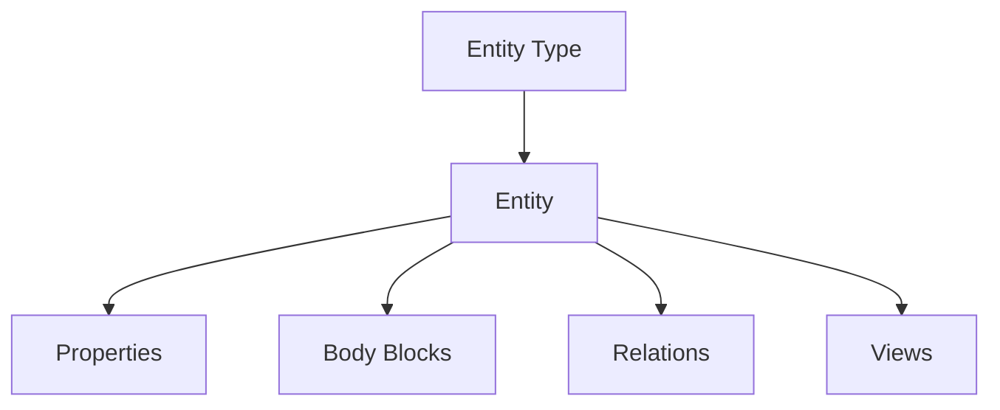

# 01 Core Data Model

## Problem

Ein Worldbuilding-Tool stirbt, wenn es nur Seiten speichert. Seiten sind gut fuer Prosa, aber schlecht fuer:

- wiederverwendbare NPCs
- Quest-Abhaengigkeiten
- Kartenpins
- Sichtbarkeit
- Tabellenansichten
- Timelines
- Regeln
- Balance-Auswertung

Darum sollte die Grundstruktur ein Entity-System sein.

## Core Concept



Eine Entity ist ein objektartiger Datensatz mit freiem Text und strukturierten Properties.

Beispiele:

| Entity Type | Beispiele |
|---|---|
| Character | NPC, Player Character, Patron, Villain |
| Location | Region, City, Dungeon Room, Landmark |
| Faction | Guild, Kingdom, Cult, Tribe |
| Item | Artifact, Clue, Consumable, Treasure |
| Culture | Species, People, Religion, Custom |
| Event | Historical Event, Session Event, Trigger |
| Quest | Main Quest, Side Quest, Rumor, Objective |
| Scene | Encounter, Social Scene, Investigation Beat |
| Rule | Condition, Travel Rule, House Rule |
| Resource | Image, Map, PDF, Audio, External Link |

## Recommended Entity Shape

```json
{
  "id": "ent_01J...",
  "type": "character",
  "title": "Silas",
  "aliases": ["Gnome fence", "Arcane battery contact"],
  "summary": "Gnome fence connected to stolen arcane batteries.",
  "body": {
    "format": "portable_blocks_v1",
    "blocks": []
  },
  "properties": {
    "status": "active",
    "importance": "major",
    "tags": ["waterdeep", "criminal", "lead"],
    "source": "homebrew"
  },
  "visibility": {
    "default": "gm_only"
  },
  "created_at": "2026-06-22T20:00:00Z",
  "updated_at": "2026-06-22T20:00:00Z"
}
```

## Entity Type Schema

Jeder Entity Type bekommt ein Schema. Dieses Schema beschreibt:

- Property-Felder
- erlaubte Werte
- Pflichtfelder
- Defaultwerte
- Relation-Typen
- Default-Views
- Default-Card-Templates
- optionale UI-Ergaenzungen

```json
{
  "type": "character",
  "label": "Character",
  "schema_version": "1.0.0",
  "properties_schema": {
    "type": "object",
    "properties": {
      "role": {
        "type": "string",
        "enum": ["ally", "neutral", "enemy", "unknown"]
      },
      "status": {
        "type": "string",
        "enum": ["active", "dead", "missing", "unknown"]
      },
      "party_known": {
        "type": "boolean",
        "default": false
      }
    }
  },
  "allowed_relations": ["member_of", "located_in", "knows_secret", "enemy_of"]
}
```

## JSON Schema als Basis

JSON Schema ist sinnvoll, weil es Validierung, Dokumentation und UI-Hints in einem Standardformat erlaubt. Die offizielle Validation Vocabulary beschreibt explizit Validierung, semantische Hinweise fuer UIs und Assertions ueber gueltige Dokumente.

Nutzen:

- Plugin-Schemas bleiben maschinenlesbar.
- Imports koennen validiert werden.
- Default-Forms koennen aus Schemas generiert werden.
- Fehler koennen schon beim Laden gefunden werden.

Grenze:

- JSON Schema beschreibt Struktur, aber nicht ausreichend gute UX.
- Fuer komplexe UI braucht man ein separates UI-Schema.

## Runtime DB

JSON als Ground Truth heisst nicht, dass die App nur JSON-Dateien direkt durchsucht. Das waere bei Volltext, Relations, Backlinks und Views schnell zaeh.

Empfohlene V1-Struktur mit SQLite:

```sql
entities(
  id TEXT PRIMARY KEY,
  type TEXT NOT NULL,
  title TEXT NOT NULL,
  summary TEXT,
  body_json TEXT NOT NULL,
  properties_json TEXT NOT NULL,
  visibility_json TEXT NOT NULL,
  created_at TEXT,
  updated_at TEXT
)

entity_types(
  type TEXT PRIMARY KEY,
  schema_json TEXT NOT NULL,
  ui_schema_json TEXT
)

relations(
  id TEXT PRIMARY KEY,
  source_id TEXT NOT NULL,
  target_id TEXT NOT NULL,
  relation_type TEXT NOT NULL,
  inverse_type TEXT NOT NULL,
  properties_json TEXT,
  created_at TEXT
)

views(
  id TEXT PRIMARY KEY,
  name TEXT NOT NULL,
  source_query_json TEXT NOT NULL,
  view_config_json TEXT NOT NULL
)
```

## Notion-Like Tables

Das interessante an Notion ist nicht "Tabellen". Es ist:

1. Jede Zeile ist eine Seite.
2. Jede Spalte ist ein Property.
3. Eine Datenbank kann mehrere Views haben.
4. Relation Properties verbinden Datensaetze ueber Datenbanken hinweg.
5. Rollups aggregieren Daten aus verbundenen Datensaetzen.

Das sollte man uebernehmen, aber mit Weltbau-Domaene veredeln.

### Minimal Nachbau

```json
{
  "view_id": "view_major_npcs",
  "label": "Major NPCs",
  "source": {
    "entity_type": "character"
  },
  "columns": [
    {"property": "title", "label": "Name"},
    {"property": "role", "label": "Role"},
    {"property": "located_in", "relation": true},
    {"property": "party_known", "label": "Known?"}
  ],
  "filter": {
    "and": [
      {"property": "importance", "eq": "major"}
    ]
  },
  "sort": [
    {"property": "title", "direction": "asc"}
  ]
}
```

wie in notions sollten wir ein paar cole property types bereit stellen. nicht nur texyt/number/date sondern auch Pills/tags (die automatisch farbige pills erzeugen) und was sonst noch so für coole einfach übernehmbare featreus in notion existieren.

## Relation Model

Bidirectional Relations sollten nicht als zwei manuell gepflegte Links gespeichert werden. Besser:

- eine kanonische Edge
- relation_type aus Sicht der Quelle
- inverse_type aus Sicht des Ziels
- UI zeigt je nach Perspektive die passende Richtung

```json
{
  "id": "rel_01J...",
  "source_id": "char_silas",
  "target_id": "faction_weavers",
  "relation_type": "member_of",
  "inverse_type": "has_member",
  "properties": {
    "certainty": "confirmed",
    "visibility": "gm_only"
  }
}
```

Damit gibt es keinen Mikromanagement-Overhead:

- User setzt "Silas member_of Weavers".
- System zeigt automatisch bei Weavers "has_member Silas".
- Aenderung passiert an einer Edge, nicht an zwei Kopien.

## Relation Type Registry

```json
{
  "relation_type": "member_of",
  "label": "member of",
  "inverse": "has_member",
  "allowed_source_types": ["character"],
  "allowed_target_types": ["faction", "organization"],
  "symmetry": "directed",
  "default_visibility": "gm_only"
}
```

Symmetrie-Typen:

| Symmetry | Beispiel | Verhalten |
|---|---|---|
| directed | located_in / contains | Quelle und Ziel haben verschiedene Labels |
| symmetric | enemy_of / enemy_of | beide Seiten gleich |
| reciprocal | teacher_of / student_of | beide Seiten verschieden, aber logisch gekoppelt |
| temporal | became_ruler_of | Relation hat Zeitbereich |

## DB Choice

| Option | Vorteile | Nachteile | Empfehlung |
|---|---|---|---|
| JSON only | maximal portabel | schlechte Suche, langsame Relations, keine echten Views | nur als Exportformat |
| SQLite | lokal, einfach, FTS5, portable DB-Datei | weniger stark bei parallelem Multiuser | V1 beste Wahl |
| PostgreSQL | JSONB, GIN, starke Suche, skalierbar | Serverbetrieb, Setup-Aufwand | spaeter optional |
| Neo4j | Graph natuerlich modelliert | Zusatzsystem, Export/Offline schwerer | fuer Analyse optional, nicht V1 |

## Decision Questions

1. Gibt es eine feste Liste von Core Entity Types oder startet alles aus Plugins? --> Feste Core Types
2. Duerfen Plugins Core Types erweitern? --> ja, aber nur additiv
3. Werden Relation Types global registriert oder je Ruleset/Plugin? --> global, aber mit Quelle=plugin/Core
4. Sollen Properties versioniert werden, wenn ein Plugin-Schema geaendert wird? --> nein
5. Wie hart wird validiert: Fehler blockiert Import oder nur Warnung? --> Warnung und skip (falls keine abhängigkeiten)

## Recommendation

Fuer V1:

- Core Types minimal halten: Character, Location, Faction, Item, Event, Quest, Scene, Rule, Resource.
- Alles andere als Plugin-Type.
- Entities als JSON serialisieren.
- SQLite als runtime index/cache.
- Relations als Edge Table.
- Relation Types in Registry.
- Jede Zeile ist immer oeffenbar als Seite.

## Sources

- JSON Schema validation: https://json-schema.org/draft/2020-12/json-schema-validation
- Notion data source properties: https://developers.notion.com/reference/property-object
- Notion relations and rollups: https://www.notion.com/help/relations-and-rollups
- SQLite FTS5: https://sqlite.org/fts5.html
- PostgreSQL GIN indexes: https://www.postgresql.org/docs/current/gin.html
- Neo4j graph database concepts: https://neo4j.com/docs/getting-started/graph-database/
