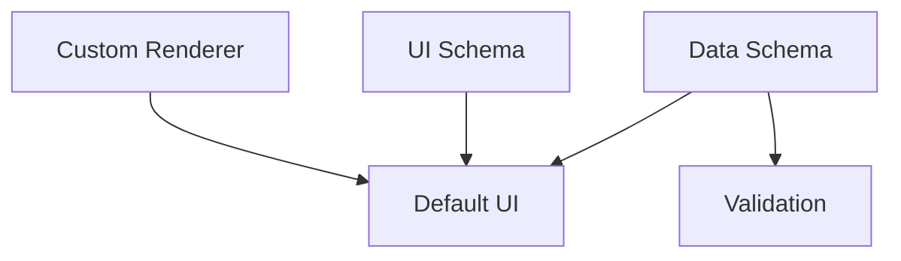

# 08 UI Plugin Architecture

## Problem

Du willst strukturelle Config via JSON, aber nicht jede neue Struktur passt automatisch in jede UI.

Kernfrage:

> Muss eine Plugin immer auch UI-JSON mitliefern, oder reicht Schema?

Antwort:

> Hybrid. JSON Schema erzeugt eine brauchbare Default-UI. UI-JSON ist optional, aber Pflicht, sobald das Plugin mehr will als Standardfelder.

## Three Layers



## Layer 1: Data Schema

Beschreibt, was Daten sind.

```json
{
  "properties": {
    "threat_level": {
      "type": "integer",
      "minimum": 0,
      "maximum": 5,
      "default": 1
    }
  }
}
```

## Layer 2: UI Schema

Beschreibt, wie Daten angezeigt/bearbeitet werden.

JSON Forms und react-jsonschema-form trennen genau diese Konzepte: JSON Schema beschreibt Daten, UI Schema beschreibt Rendern/Layout.

```json
{
  "type": "VerticalLayout",
  "elements": [
    {
      "type": "Control",
      "scope": "#/properties/threat_level",
      "options": {
        "control": "slider",
        "step": 1
      }
    }
  ]
}
```

## Layer 3: Custom Renderer

Nur fuer Spezialfaelle:

- Map picker
- relation graph selector
- card layout preview
- timeline editor
- statblock editor
- dice expression editor
- condition builder

Plugin darf dann sagen:

```json
{
  "renderer": "core.dice_expression_editor",
  "scope": "#/properties/damage"
}
```

Aber Renderer muessen registriert sein. Kein beliebiges Script in Plugin JSON fuer V1.

## Plugin Manifest

```json
{
  "id": "plugin_dnd5e_basic",
  "label": "D&D 5e Basic",
  "version": "1.0.0",
  "compatibility": {
    "app_schema": ">=1.0.0 <2.0.0"
  },
  "entity_types": ["spell", "monster", "condition"],
  "relation_types": ["casts", "resistant_to", "vulnerable_to"],
  "views": [],
  "card_templates": [],
  "rules": []
}
```

## Entity Type Plugin

```json
{
  "type": "spell",
  "label": "Spell",
  "schema": {
    "type": "object",
    "required": ["level", "casting_time"],
    "properties": {
      "level": {"type": "integer", "minimum": 0, "maximum": 9},
      "casting_time": {"type": "string"},
      "range": {"type": "string"},
      "damage": {
        "type": "array",
        "items": {
          "type": "object",
          "properties": {
            "dice": {"type": "string"},
            "type": {"type": "string"}
          }
        }
      }
    }
  },
  "ui_schema": {
    "layout": "sections",
    "sections": [
      {"label": "Basics", "fields": ["level", "casting_time", "range"]},
      {"label": "Damage", "fields": ["damage"]}
    ]
  }
}
```

## Decision Matrix

| Approach | Vorteile | Nachteile | Empfehlung |
|---|---|---|---|
| Nur JSON Schema | schnell, wenig Arbeit | UI oft mittelmaessig, komplexe Felder scheitern | nur Default |
| Immer UI-JSON Pflicht | maximale Kontrolle | hoher Plugin-Aufwand | zu streng |
| Hybrid | gute Defaults + Spezialfaelle moeglich | Renderer-Registry noetig | beste Wahl |
| Plugin liefert eigenes JS | maximale Freiheit | Sicherheits-/Kompatibilitaetsproblem | nicht V1 |
| Core UI fuer alles | konsistent | blockiert Erweiterbarkeit | zu starr |

## UI Schema Vocabulary

Minimal eigene UI-JSON Begriffe:

| Element | Zweck |
|---|---|
| Section | gruppiert Felder |
| Control | einzelnes Feld |
| RelationPicker | Entity Relation setzen |
| EntityPicker | Entity auswaehlen |
| TagPicker | Tags |
| DiceInput | Dice Expression |
| ConditionBuilder | Visibility Formula |
| MapCoordinatePicker | Punkt auf Karte |
| Repeater | wiederholbare Felder |
| Preview | Card/Handout Preview |

## Safe Plugin Rules

1. Plugin JSON darf keine beliebigen Scripts enthalten.
2. Plugin darf nur registrierte Renderer referenzieren.
3. Schema muss validierbar sein.
4. Plugin bekommt eigene Version.
5. Import migriert Daten oder markiert sie als outdated.
6. Unbekannte Plugin-Felder bleiben erhalten, auch wenn UI sie nicht versteht.

## Local App Options

| Shell | Vorteile | Nachteile | Empfehlung |
|---|---|---|---|
| Browser + local server | einfach, flexibel | wirkt weniger wie Desktop-App | sehr gut fuer V1 |
| pywebview | Python-nah, leicht, Web-UI | Packaging pruefen | gut fuer Python-Prototyp |
| Tauri | kleine Desktop-App, Web-UI, Rust Backend | Rust-Komplexitaet | gut fuer spaeter |
| Electron | riesiges Oekosystem | schwerer, groesser | nur wenn Node/Desktop-Features wichtig |

Da Technologie offen bleiben soll: erst Web-App + Local Server spezifizieren. Desktop-Wrapping spaeter.

## JSON Ground Truth + DB Cache

Flow:

```text
project/*.json
  -> validate
  -> import into SQLite
  -> build FTS/relation indexes
  -> edit in UI
  -> write JSON snapshot/export
```

Wichtig:

- DB darf aus JSON wiederherstellbar sein.
- JSON Export darf keine UI-only Runtime-Indizes brauchen.
- DB kann abgeleitete Views/Indices speichern.

## Decision Questions

1. Soll Plugin UI-Schema optional oder ab bestimmtem Feldtyp Pflicht sein? --> optional, pflicht wenn custom elmente in der Struktur-json sind
2. Welche Renderer sind Core? --> siehe tabelle unten
3. Duerfen Plugins eigene Icons/Themes liefern? --> ja
4. Wie werden Plugin-Versionen migriert? --> full replace
5. Sollen Plugins per Dateiordner geladen werden? --> ja  im frontend easy plug n play, abe rim hintergrund in einem zentralen plugin-Bereich abgelegt
6. Sollen Plugins spaeter signiert werden? --> nicht geplant

Allgemeine Pflicht-Renderer:
| Renderer                     | Zweck                         | Beispiel                    |
| ---------------------------- | ----------------------------- | --------------------------- |
| `core.text_input`            | kurzer Text                   | Name, Alias                 |
| `core.text_area`             | längerer Plain Text           | Kurzbeschreibung            |
| `core.rich_text`             | strukturierter Body           | Lore-Artikel, Session Notes |
| `core.number_input`          | Zahlen                        | DC, Level, CR               |
| `core.boolean_toggle`        | true/false                    | discovered, active          |
| `core.select`                | einzelne Auswahl              | Status, Kategorie           |
| `core.multi_select`          | mehrere Werte                 | Tags, Klassen, Damage Types |
| `core.date_time_picker`      | Weltzeit / Datum              | Event-Datum                 |
| `core.entity_picker`         | Entity auswählen              | NPC, Location, Quest        |
| `core.relation_picker`       | typisierte Relation setzen    | `member_of`, `located_in`   |
| `core.repeater`              | wiederholbare Gruppen         | Damage Dice, Loot Entries   |
| `core.condition_builder`     | Sichtbarkeits-/Trigger-Regeln | `show_if clue_found`        |
| `core.file_asset_picker`     | Bild/PDF/Datei wählen         | Portrait, Handout           |
| `core.map_coordinate_picker` | Punkt/Shape auf Karte wählen  | Kartenpin                   |
| `core.dice_expression_input` | Würfelausdruck                | `2d6+3`, `4d10`             |
| `core.markdown_preview`      | Markdown/Export-Vorschau      | Handout Preview             |

Worldbuilding-Renderer:
| Renderer                     | Warum Core?                                                    |
| ---------------------------- | -------------------------------------------------------------- |
| `core.entity_embed`          | Session Pages sollen Lore einbetten statt duplizieren          |
| `core.secret_block`          | Sichtbarkeit ist zentrales Feature                             |
| `core.map_marker_editor`     | Map + Lore bidirektional                                       |
| `core.timeline_event_editor` | Events brauchen Zeit, Ort, Teilnehmer                          |
| `core.card_preview`          | Handout/Card-Pipeline                                          |
| `core.statblock_editor`      | Rules/Monster/NPCs brauchen kompakte strukturierte Darstellung |
| `core.rule_reference_block`  | DM Screen / Regelhilfe                                         |
| `core.capture_inbox_item`    | schneller Session-Capture mit Nacharbeitsflag                  |


## Recommendation

Fuer V1:

- JSON Schema Pflicht.
- UI Schema optional.
- Default Form Generator.
- Custom Renderer nur aus Core Registry.
- Plugin darf Views, Entity Types, Relation Types, Card Templates, Rules liefern.
- Keine Plugin-JS-Ausfuehrung.
- Local Server + Web Frontend als Referenzarchitektur.

## Sources

- JSON Forms UI schema: https://jsonforms.io/docs/uischema/
- JSON Forms React integration: https://jsonforms.io/docs/integrations/react
- react-jsonschema-form docs: https://rjsf-team.github.io/react-jsonschema-form/docs/
- react-jsonschema-form uiSchema: https://rjsf-team.github.io/react-jsonschema-form/docs/api-reference/uiSchema/
- Tauri: https://v2.tauri.app/start/
- Electron: https://electronjs.org/docs/latest/
- pywebview: https://pywebview.flowrl.com/
- Datasette: https://datasette.io/
