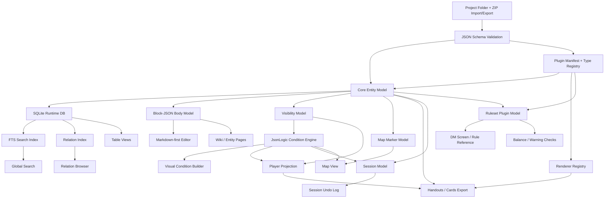
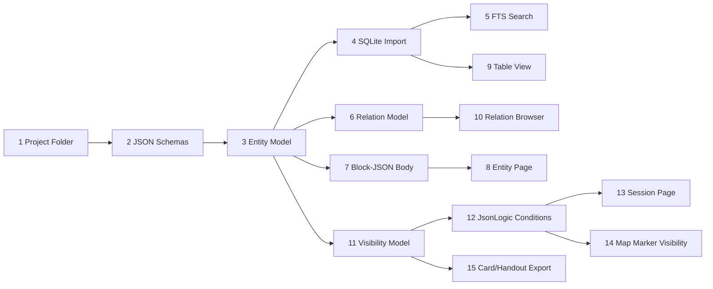

# 11 Module Dependency Map

Dieses Dokument beschreibt, welche Module aufeinander aufbauen, welche Technologien als Kernvoraussetzung gelten und welche Bausteine in mehreren Features wiederverwendet werden.

## Dependency Principle

Das System sollte nicht feature-first gebaut werden, sondern kernmodell-first.

Die meisten sichtbaren Features sind Projektionen auf dieselben Grunddaten:

```text
Project JSON -> Validation -> SQLite Runtime -> Indexes -> Views/Features
```

Wenn Entity Model, Storage, Relations, Visibility und Search sauber stehen, koennen Wiki, Tables, Maps, Sessions, Cards, Rules und Plugins darauf aufsetzen.

## High-Level Dependency Graph



## Core Technology Layers

| Layer | Module | Role | Used By |
|---|---|---|---|
| Storage | Project Folder | Ground Truth fuer lokale Arbeit | alles |
| Storage | ZIP Import/Export | Austausch, Backup, Import | Projektverwaltung, Sharing |
| Validation | JSON Schema | validiert Core- und Plugin-Daten | Import, Plugins, Forms |
| Runtime | SQLite | lokaler Query-/Index-/Cache-Layer | Search, Tables, Relations, Sessions |
| Search | SQLite FTS5 | Volltextsuche | Global Search, Entity Picker, Rule Lookup |
| Content | Entity Model | zentrale Datenform | alle Feature Views |
| Content | Block-JSON Body | strukturierter Text + Embeds | Wiki, Sessions, Cards, Handouts |
| UX | Markdown-first Editor | Authoring UX fuer Body Blocks | Entity Pages, Session Notes, Rules |
| Logic | JsonLogic | gespeicherte Bedingungen | Visibility, Maps, Sessions, Exports |
| Logic | Condition Builder | nutzbare UI fuer JsonLogic | GM Visibility, Session Triggers |
| Extensibility | Plugin Manifest | Plugin-Ladepunkt | Entity Types, Rulesets, Cards, Views |
| Extensibility | Renderer Registry | sichere Spezial-UI | Forms, Cards, Rules, Maps |

## Feature Dependencies

| Feature | Direct Dependencies | Indirect Dependencies | Notes |
|---|---|---|---|
| Entity Page | Entity Model, Block-JSON, Editor | Project Folder, Validation | erste sichtbare Kern-UI |
| Table View | SQLite Runtime, Entity Type Schema | Entity Model, Validation | Notion-aehnliche Views |
| Global Search | SQLite FTS5 | SQLite Runtime, Entity Model | muss frueh kommen, sonst leidet alles |
| Relation Browser | Relation Model, Relation Index | Entity Model, SQLite | Basis fuer Graph, Quest Checks, Backlinks |
| Plugin Loading | Plugin Manifest, JSON Schema | Project Folder, Validation | Grundlage fuer Rulesets und Custom Types |
| Custom Entity Types | Plugin Loading, Entity Type Registry | JSON Schema, Renderer Registry | Erweiterbarkeit ohne Core-Aenderung |
| Visibility | Visibility Model, JsonLogic | Entity Model, Block-JSON | muss nicht spaeter angeklebt werden |
| Player View | Visibility, Condition Engine | Entity Model, Session Context | Projektion, keine zweite Welt |
| Session Pages | Entity Embeds, Visibility, Session Model | Block-JSON, JsonLogic | Live-Modus fuer PnP |
| Session Undo | Session Action Log | Session Model | gezieltes Undo fuer GM-Missklicks |
| Map View | Map Model, Map Marker Model | Assets, Entity Model, Visibility | Marker referenzieren Entities |
| Map Export | Map View, Player Projection | Visibility, JsonLogic | player-facing Karten |
| Cards | Card Template Model, Renderer Registry | Entity Model, Visibility | Projection, keine eigene Wahrheit |
| PDF/PNG Export | Cards/Handouts, Export Renderer | Visibility, Templates | V1 Pflicht, aber template-basiert |
| Ruleset Plugin | Plugin Loading, Rule Entity Model | Entity Model, Source/Licenses | DnD/SRD als Beispielstruktur |
| DM Screen | Saved Dashboard Views, Rules | Search, Tables, Entity Embeds | spaeter gut, aber nicht erster Kern |
| Balance Warnings | Ruleset Plugin, Relations, Variables | Graph Traversal, Session/Party Data | erst sinnvoll nach Rules + Relations |
| Timeline | Event Model, Time Model | Entity Model, Relations, Visibility | kann vorbereitet, aber spaeter ausgebaut werden |
| Board View | Saved View + Entity References | Entity Model, Relations | braucht stabile Entity/Relation APIs |

## Reusable Core Capabilities

### Entity Picker

Wiederverwendet in:

- Relations
- Map Marker
- Session Embeds
- Board Nodes
- Card Templates
- Rule References
- Quest Dependencies

### Relation Picker

Wiederverwendet in:

- Entity Page
- Graph View
- Quest Flow
- Faction/Character Networks
- Rule/Content Warnings

### Visibility Context

Wiederverwendet in:

- Player View
- Session Pages
- Map Marker Visibility
- Handout Export
- Card Export
- Rule Notes

### Condition Builder

Wiederverwendet in:

- Session Reveals
- Map Reveals
- Timer/Counter Triggers
- Conditional Handouts
- Quest/Rule Warnings
- Plugin-defined conditions

### Search Index

Wiederverwendet in:

- Global Search
- Entity Picker
- Relation Picker
- Rule Lookup
- Capture Inbox Processing
- "mentioned in" / backlinks

### Renderer Registry

Wiederverwendet in:

- Plugin Forms
- Entity Type Forms
- Rule Editors
- Condition Builder
- Map Coordinate Picker
- Dice Expression Input
- Card Preview

## Critical Path For Architecture Prototype

Das ist die minimale Reihenfolge, die am meisten spaetere Features entsperrt:



## Suggested Build Order

### Foundation

1. Project folder structure
2. ZIP import/export
3. JSON schemas for core files
4. Core Entity JSON shape
5. SQLite import/cache
6. FTS5 search table

### Core Data UX

1. Entity list
2. Entity page
3. Markdown-first editor backed by Block-JSON
4. Table view from Entity Type schemas
5. Entity picker
6. Relation model and relation picker

### PnP Core

1. Visibility model
2. JsonLogic condition storage
3. Visual condition builder
4. Session page model
5. Session action log and undo
6. Player projection

### Spatial And Export

1. Asset/resource handling
2. Map import
3. Map marker records
4. Map annotation UI
5. Card templates
6. PDF/PNG export

### Extensibility And Rules

1. Plugin folder loader
2. Plugin manifest validation
3. Entity type registry
4. Renderer registry
5. Ruleset plugin model
6. Source/license metadata
7. Rule references and DM screen panels

## Dependency Hotspots

| Hotspot | Why It Matters | Design Constraint |
|---|---|---|
| Entity IDs | Alles referenziert Entities | stabile IDs, keine title-basierten Links |
| Body Blocks | Wiki, Sessions und Cards nutzen dieselben Inhalte | keine reine Markdown-only Wahrheit |
| Visibility | Player View, Maps, Cards und Sessions haengen daran | frueh ins Modell, nicht spaeter ankleben |
| Relations | Quest Checks, Graph, Maps und Search profitieren davon | Edge-Modell statt doppelte Links |
| SQLite Import | Search und Views brauchen Querying | DB jederzeit aus JSON rebuildbar |
| Plugin Registry | Custom Types und Rulesets brauchen konsistente Erweiterung | keine Plugin-Scripts in V1 |
| Renderer Registry | Spezialfelder brauchen gute UI | nur registrierte Core Renderer |
| Source/Licenses | Rules Import darf nicht unklar sein | jede Rule Entity referenziert Quelle |

## What Can Be Deferred Safely

Diese Dinge sind wichtig, aber nicht Voraussetzung fuer den ersten Kern:

- voller Card Designer
- globale Graph-Hairball-Ansicht
- State-at-Time Query Engine
- echte Player Accounts
- Multiuser/Cloud Sync
- PostgreSQL Backend
- AI Assistenz
- komplexe VTT-Funktionen wie Dynamic Lighting oder Initiative
- vollstaendige Entity-History

## Minimal Proof-of-Concept Scope

Der kleinste PoC, der die Architektur sinnvoll prueft:

```text
Project folder + ZIP import/export
Core Entity JSON
JSON Schema validation
SQLite import
FTS5 search
Entity list
Entity page
Table view
Relation model
Map with one imported image and pins
Visibility field with stored JsonLogic
Simple card export from one Entity
```

Dieser PoC prueft die zentralen Annahmen, ohne direkt in VTT, AI, Card Designer oder Ruleset-Komplexitaet zu versinken.

